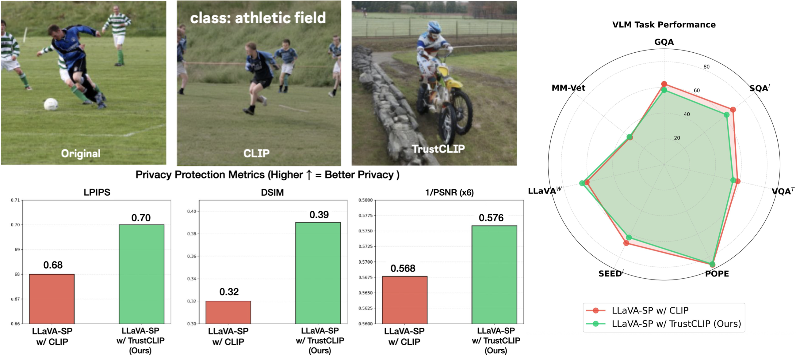

<div align="center">

# TrustCLIP: Learning Private Visual Features via Adversarial Reconstruction

### ECCV 2026

[Nikos Athanasiou](https://atnikos.github.io/)<sup>1,2,&#42;</sup>,
Ilya A. Petrov<sup>1,3,&#42;</sup>,
Angela Yao<sup>1,4</sup>,
Shugao Ma<sup>1</sup>,
Eric Sauser<sup>1</sup>,
Edoardo Remelli<sup>1</sup>,
Shreyas Hampali<sup>1</sup>,
Johannes Schönberger<sup>1</sup>,
Fadime Sener<sup>1</sup>,
Bugra Tekin<sup>1</sup>

<sup>1</sup>Meta, Zürich &nbsp;&middot;&nbsp;
<sup>2</sup>Max Planck Institute for Intelligent Systems, Tübingen &nbsp;&middot;&nbsp;
<sup>3</sup>University of Tübingen &nbsp;&middot;&nbsp;
<sup>4</sup>National University of Singapore

<sup>&#42;</sup>Work done during a Meta internship.

<!-- TODO: replace empty links with real URLs when available -->
[]()
[]()
[](https://atnikos.github.io/trustclip/)
[]()



<sub>📄 <a href="static/images/teaser.pdf">High-resolution teaser (PDF)</a></sub>

</div>

> **TrustCLIP ensures privacy for visual understanding tasks while preserving task utility.**
> Reconstructions from vanilla CLIP features reveal detailed, identity-revealing content, whereas
> TrustCLIP features prevent meaningful recovery of the original image while retaining class semantics.
> A VLM (LLaVA-SP) built on TrustCLIP stays competitive with the unprotected baseline across standard
> benchmarks, while privacy metrics confirm substantially less reconstructible features.

## Abstract

Vision and vision–language models rely on high-level visual representations that are increasingly used
across recognition, retrieval, and multimodal reasoning pipelines. However, recent advances in generative
modeling have shown that such features can often be inverted, enabling realistic reconstructions of the
underlying image and raising significant privacy risks. We revisit this problem through the lens of
reconstruction and propose **TrustCLIP**, a reconstruction-driven framework that treats a feature-conditioned
generator as an explicit privacy adversary. TrustCLIP learns a projection between encoder features and
downstream modules that is explicitly optimized to degrade the reconstructions produced by generative
attackers while retaining the necessary signals for downstream tasks. Unlike prior defenses that rely on
discriminative privacy metrics, TrustCLIP directly optimizes against a generative reconstruction attacker,
targeting a threat not captured by standard evaluation protocols. We demonstrate its effectiveness in both
conventional classification and multimodal large language model pipelines. Across these settings, TrustCLIP
consistently reduces the fidelity of generative inversions while maintaining downstream task performance.

## News

- **2026** — TrustCLIP is accepted to **ECCV 2026**. Code release coming soon.

## Installation

_Coming soon._

## Data & Checkpoints

_Coming soon._

## Training

_Coming soon._

## Evaluation

_Coming soon._

## Acknowledgements

_Coming soon._

## Citation

If you find this work useful, please consider citing:

```bibtex
@inproceedings{athanasiou2026trustclip,
  title     = {TrustCLIP: Learning Private Visual Features via Adversarial Reconstruction},
  author    = {Athanasiou, Nikos and Petrov, Ilya A. and Yao, Angela and Ma, Shugao
               and Sauser, Eric and Remelli, Edoardo and Hampali, Shreyas
               and Sch{\"o}nberger, Johannes and Sener, Fadime and Tekin, Bugra},
  booktitle = {European Conference on Computer Vision (ECCV)},
  year      = {2026}
}
```
